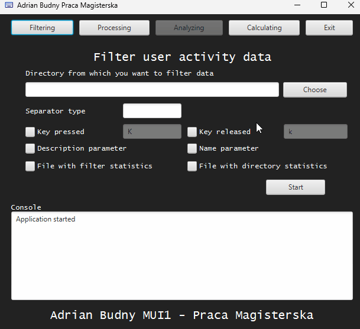
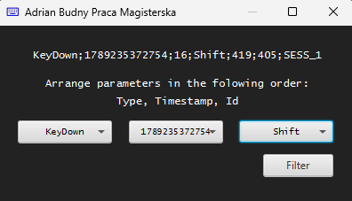

# Aplikacja do utworzenia profilu biometrycznego z cech wyznaczonych na podstawie aktywności użytkownika

Aplikacja desktopowa pozwalająca na utworzenie profilu biometrycznego. Owy profil składa się z cech biometrycznych wyznaczonych na podstawie wcześniej przygotowanych
danych, które zawierają informacje o aktywności użytkownika związanej z wykorzystaniem klawiatury.

---

## Demo / Prezentacja działania

Poniższa animacja przedstawia pełny przepływ pracy w aplikacji (*pipeline* analityczny): od wczytania surowych danych telemetrycznych ze zbioru demonstracyjnego, przez wstępne czyszczenie szumu pomiarowego, obliczanie zależności czasowych aż po wygenerowanie profilu biometrycznego użytkownika. Dodatkowo w trakcie prezentacji celowo wywoływane są typowe błędy użytkownika (np. zamknięcie pop-upa, brakujące parametry), aby zademonstrować wbudowane mechanizmy walidacji danych i odporność aplikacji na niepoprawne akcje.

<p align="center">
  
</p>

---

## O projekcie

Aplikacja została zaprojektowana i zrealizowana w ramach pracy inżynierskiej, a następnie rozbudowana w trakcie pracy magisterskiej na Wydziale Nauk Ścisłych i Technicznych Uniwersytetu Śląskiego.

Aplikacja przeznaczona jest dla osób wykonujących badania w dziedzinie analizy behawioralnej związanej z aktywnością użytkownika podczas pracy z komputerem.
Główną aktywnością użytkownika uwzględnioną w niniejszej aplikacji jest dynamika pisania na klawiaturze `KD` (_ang._ Keystroke Dynamics).
Aplikacja stanowi solidną bazę do badań, które można przykładowo wykorzystać do stworzenia systemu bezpieczeństwa opartego na weryfikacji ciągłej.
Taki system mógłby zablokować dostęp do komputera osobie nieuprawnionej, tylko na podstawie analizowania jej sposobu (dynamiki) pisania na klawiaturze `KDA` (_ang._ Keystroke Dynamics Analysis).

Aplikacja zawiera wszystkie potrzebne narzędzia do wykonania badań, a podzielone na podprogramy narzędzia można wykorzystywać niezależnie od siebie.

---

## Kluczowe funkcjonalności

* **Filtrowanie (_ang._ Filtering):** pierwszy podprogram aplikacji umożliwiający zmianę dowolnych danych surowych na format kompatybilny z dalszymi podprogramami i przygotowanie tylko najpotrzebniejszych informacji. Operacje, które obejmuje filtrowanie to:
  * wczytanie danych surowych (np. pliki tekstowe txt/csv),
  * odfiltrowanie danych niepotrzebnych,
  * zmiana formatu danych (np. dostosowanie kolejności oraz zmiana oznaczenia pewnych parametrów),
  * dodanie parametrów pomocniczych,
  * zebranie statystyk danych surowych (np. ilości wystąpień klawiszy, identyfikatory klawiszy, wprowadzone zmiany).

* **Przetwarzanie (_ang._ Processing):** drugi podprogram aplikacji umożliwiający wyliczenie zależności czasowych z wcześniej filtrowanych danych oraz przygotowanie ich do dalszej analizy. Operacje, które obejmuje przetwarzanie to:
  * wyznaczanie zależności czasowych,
  * dodanie znaczników pomocniczych,
  * usunięcie elementów odstających.

* **Obliczanie (_ang._ Calculating) - dodane w pracy magisterskiej:** trzeci podprogram aplikacji umożliwiający na obliczenie wektorów cech z wcześniej przygotowanych zależności czasowych. Operacje, które obejmuje obliczanie to:
  * odseparowanie zależności czasowych klawiszy alfanumerycznych (jedno z założeń pracy magisterskiej),
  * obliczenie wektorów cech na podstawie specjalnego algorytmu.

---

## Zrzuty ekranu

<p align="center">
  
  <br>
  <em>Rysunek 1: Widok główny podprogramu „Filtering”.</em>
</p>

<br>

<p align="center">
  
  <br>
  <em>Rysunek 2: Pop-up wyświetlający prośbę o ustawienie parametrów w podprogramie „Filtering”.</em>
</p>

<br>

<p align="center">
  
  <br>
  <em>Rysunek 3: Widok główny podprogramu „Processing”.</em>
</p>

<br>

<p align="center">
  
  <br>
  <em>Rysunek 4: Widok główny podprogramu „Calculating”.</em>
</p>

---

## Technologie i narzędzia

* **Język:** Java 17
* **Interfejs graficzny:** JavaFX 21 / Scene Builder / FXML / CSS
* **Środowisko:** Eclipse IDE

---

## Instrukcja instalacji i uruchomienia

### Wymagania
* Java JDK w wersji 17
* JavaFX SDK w wersji 21
* Środowisko: Eclipse IDE for Java Developers lub inne dowolne IDE

### Instrukcja (dla Eclipse IDE)

1. Sklonuj repozytorium:
   ```bash
   git clone https://github.com/AdiKungen/Aplikacja_Magisterska_Budny_Adrian_MUI1.git
   ```

2. Zaimportuj projekt do Eclipse:
   * Wybierz `File` -> `Import...` -> `General` -> `Projects from Folder or Archive`.
   * Wskaż pobrany folder z projektem.

3. Skonfiguruj JavaFX w projekcie:
   * Kliknij prawym przyciskiem myszy na projekt -> `Build Path` -> `Configure Build Path....`
   * Przejdź do zakładki `Libraries`, zaznacz `Modulepath`, kliknij `Add External JARs...` i wskaż wszystkie pliki `.jar` z folderu `lib` pobranego JavaFX SDK.

4. Uruchomienie:
   * Kliknij prawym przyciskiem myszy na `Main.java` w pakiecie application -> `Run As` -> `Java Application`.

### Uwaga dotycząca danych testowych:

Aplikacja została stworzona do badań nad biometrią behawioralną skupiającą się na wykorzystaniu przez użytkownika klawiatury (`KDA`). Zbiory danych wykorzystywane do badań nad `KDA` zawierają dane wrażliwe (historia klawiszy oraz czasu ich wciśnięcia/puszczenia), więc zostają udostępnione tylko w celach badawczych często pod bardzo rygorystycznymi klauzulami poufności. Z tego względu, oryginalne zbiory badawcze nie zostały upublicznione. Do celów demonstracyjnych dołączono w folderze `demo-data` syntetycznie wygenerowane zbiory testowe `001_sample_kda_dataset_Shift.csv` oraz `002_sample_kda_dataset_Caps.csv` o podobnej strukturze do oryginalnych zbiorów badawczych.

Obydwa zbiory (`001_sample_kda_dataset_Shift.csv`, `002_sample_kda_dataset_Caps.csv`) zawierają syntetyczne dane telemetryczne KDA symulujące przepisywanie tekstu "Badania Dynamiki Pisania Na Klawiaturze KDA 2026". Dane wzbogacono o przykładowy szum (m.in. współrzędne kursora myszy), co pozwala zaprezentować moduł wstępnego czyszczenia i walidacji danych.

Pliki odzwierciedlają dwa odmienne profile behawioralne oparte na nawykach wprowadzania wielkich liter (z probabilistyczną szansą 85% na wybór preferowanego klawisza i 15% na odstępstwo od reguły):
* `001_sample_kda_dataset_Shift.csv`: profil użytkownika "001" faworyzującego kombinację z klawiszem `Shift`.
* `002_sample_kda_dataset_Caps.csv`: profil użytkownika "002" preferującego przełączanie trybu za pomocą `Caps Lock`.

---

## Podziękowania / Credits

* **Ikona aplikacji (`keyboard`):** pochodzi z biblioteki [Material Symbols & Icons](https://fonts.google.com/icons?selected=Material+Symbols+Outlined:keyboard:FILL@0;wght@400;GRAD@0;opsz@48&icon.query=keyboard&icon.size=225&icon.color=%230000F5) od Google, udostępnionej na licencji [Apache License 2.0](https://www.apache.org/licenses/LICENSE-2.0).

---

## Licencja / License

**PL:**  
Copyright (c) 2026 Adrian Budny. Wszelkie prawa zastrzeżone.  
Kod źródłowy tego projektu udostępniony jest wyłącznie do wglądu w celach demonstracji portfolio i weryfikacji umiejętności. Kopiowanie, modyfikowanie, rozpowszechnianie lub wykorzystywanie tego kodu w celach komercyjnych lub prywatnych bez pisemnej zgody autora jest zabronione.

**EN:**  
Copyright (c) 2026 Adrian Budny. All rights reserved.  
This source code is made publicly available solely for portfolio demonstration and technical evaluation. No permission is granted to copy, modify, distribute, or use this code for any commercial or non-commercial purpose without prior written consent from the author.
